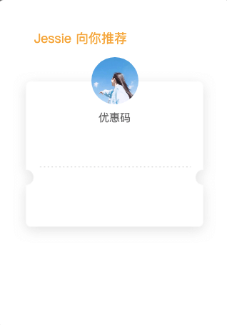
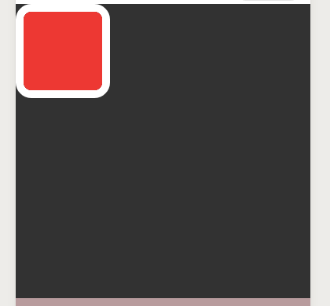
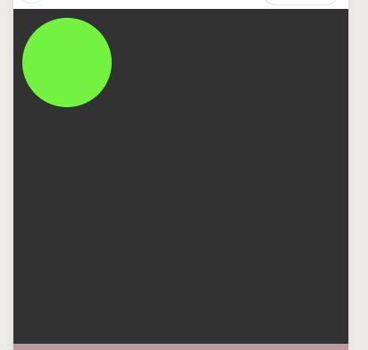
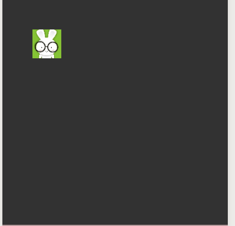
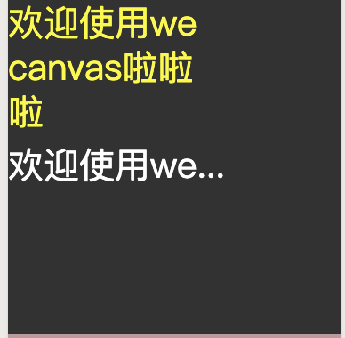

# weCanvas

简单封装的微信小程序canvas库,可以像写css一样绘制canvas.

麻麻再也不用担心我记不住api了😊

## 更新/fix

+ 修复bug `v1.0.1`
+ 按照链式调用的顺序渲染 -> 书写顺序在后的渲染在上层
+ image 支持圆角

图示


```js
    let cav = new weCanvas('PosterCouponCode',this);
    cav
    .text({
        x:50,
        y:60,
        fontSize:18,
        color:"#FFA400",
        text:"Jessie 向你推荐"
    })
    .image({
        x:20,
        y:100,
        width:285,
        height:240,
        url:"https://tc.woaap.com/Mcn/images/poster_coupon_bg.png",
    })
    .text({
        x:140,
        y:170,
        fontSize:15,
        color:"#666666",
        text:"优惠码"
    })
    .image({
        x:130,
        y:80,
        width:66,
        height:66,
        url:"https://dss0.bdstatic.com/70cFuHSh_Q1YnxGkpoWK1HF6hhy/it/u=1023235865,1560869099&fm=26&gp=0.jpg",
        radius:33,
    })
    .draw()
```

## 快速上手

### 引入

```html
<canvas class="test" canvas-id="testCanvas"></canvas>
```

```js
import WeCanvas from "xxxx";
let cav = new WeCanvas("testCanvas");
```
*在组件中时记得传入this*
```js
let cav = new WeCanvas("testCanvas",this);
```

### 绘制一个矩形

```js
cav
  .box({
    x: 10,
    y: 10,
    width: 100,
    height: 100,
    backgroundColor: "#ff0000",
    radius: 10,
    border: {
      width: 10,
      color: "#ffffff",
    },
  })
  .draw();
```

### 绘制一个圆形

```js
cav
  .box({
    x: 10,
    y: 10,
    width: 100,
    height: 100,
    backgroundColor: "#00ff00",
    radius: 50,
  })
  .draw();
```

### 绘制图片

```js
cav
  .image({
    url:
      "https://dss1.bdstatic.com/70cFuXSh_Q1YnxGkpoWK1HF6hhy/it/u=383506330,3213595831&fm=26&gp=0.jpg",
    x: 50,
    y: 50,
    width: 47.8,
    height: 47.6,
  })
  .draw();
```

### 绘制文字

```js
cav
  .text({
    text: "欢迎使用wecanvas啦啦啦",
    x: 0,
    y: 40,
    color: "yellow",
    fontSize: 40,
    maxLength: 8,
    // overflow:'ellipsis',
    overflow: "wrap",
    lineSpace: 10,
  })
  .draw();
```

### 简单的动画

```js
let cav = new WeCanvas("testCanvas");
let x = 0;
let v = 2;
let timer = setInterval(() => {
  cav
    .box({
      x: x,
      y: 10,
      width: 100,
      height: 100,
      backgroundColor: "#ff0000",
      radius: 10,
      border: {
        width: 10,
        color: "#ffffff",
      },
    })
    .box({
      x: 5,
      y: x,
      width: 100,
      height: 100,
      backgroundColor: "#0000ff",
      radius: 5,
      border: {
        width: 5,
        color: "#ffffff",
      },
    })
    .box({
      x: x,
      y: x,
      width: 100,
      height: 100,
      backgroundColor: "#00ff00",
    })
    .draw();
  if (x > 200) {
    v = -2;
  }
  if (x < 0) {
    v = 2;
  }
  x = x + v;
}, 16);
```

### 保存图片到相册
```js 
cav //
//.....xxxx  
    .draw()
    .then(()=>{
        cav.saveImage({
            canvasId: 'testCanvas',
        })
    })
```
已经内部处理掉权限问题了😊

## API

### box元素 cav.box(options)

|属性|值|说明|是否必填
|:---:|---|---|---
|x|number|左上角的横坐标|是
|y|number|左上角的纵坐标|是
|width|number|宽|是
|height|number|高|是
|backgroundColor|string|背景色|否
|border.width|number|边框宽度|否
|border.color|string|边框颜色|否
|radius|number|圆角|否

### image元素 cav.image(options)

|属性|值|说明|是否必填
|:---:|---|---|---
|url|string|图片地址|是
|x|number|左上角的横坐标|是
|y|number|左上角的纵坐标|是
|width|number|宽|否
|height|number|高|否
|radius|number|圆角|否

### text元素 cav.text(options)

|属性|值|说明|是否必填
|:---:|---|---|---
|text|string|需要绘制的文字|是
|x|number|左下角的横坐标|是
|y|number|左下角的纵坐标|是
|fontSize|number|字体大小|否
|maxLength|number|最长*字节*数|否
|lineSpace|number|行间距|否

### cav.ins()

获取canvas实例 等同于 wx.createCanvasContext()获取到的

### cav.draw(save)

`save`:是否保存上一次绘画

返回一个promise 可以在.then中 进行画图完成后的操作

### cav.saveImage(params)

`params`:非必填 等同于原来的参数

将画布保存到相册(已处理过权限问题)

## 可能会更新:)

+ 元素事件支持
+ 支持scale
+ 支持rotate
+ 支持flex布局
+ 更多属性支持


